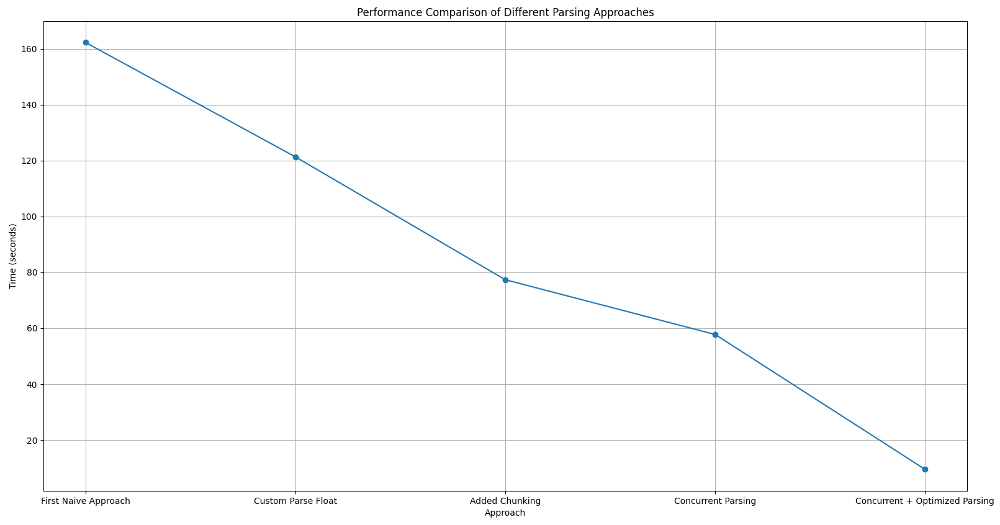

# 1BRC Challenge

## Описание

1BRC (1 Billion Row Challenge) — это челлендж по обработке огромного объема данных. Целью является оптимизация времени обработки данных до минимально возможного. В рамках данного челленджа я использовал различные подходы для парсинга данных и сравнил их эффективность.

## Результаты

* Первый самый очевидный вариант: 2m42.2705903s  
* Кастомный парсинг float: 2m1.3323314s  
* Добавил чанки для чтения файла: 1m17.3726563s  
* Параллельный парсинг: 57.7707635s  
* Оптимизированный параллельный парсинг: 9.4964078s

